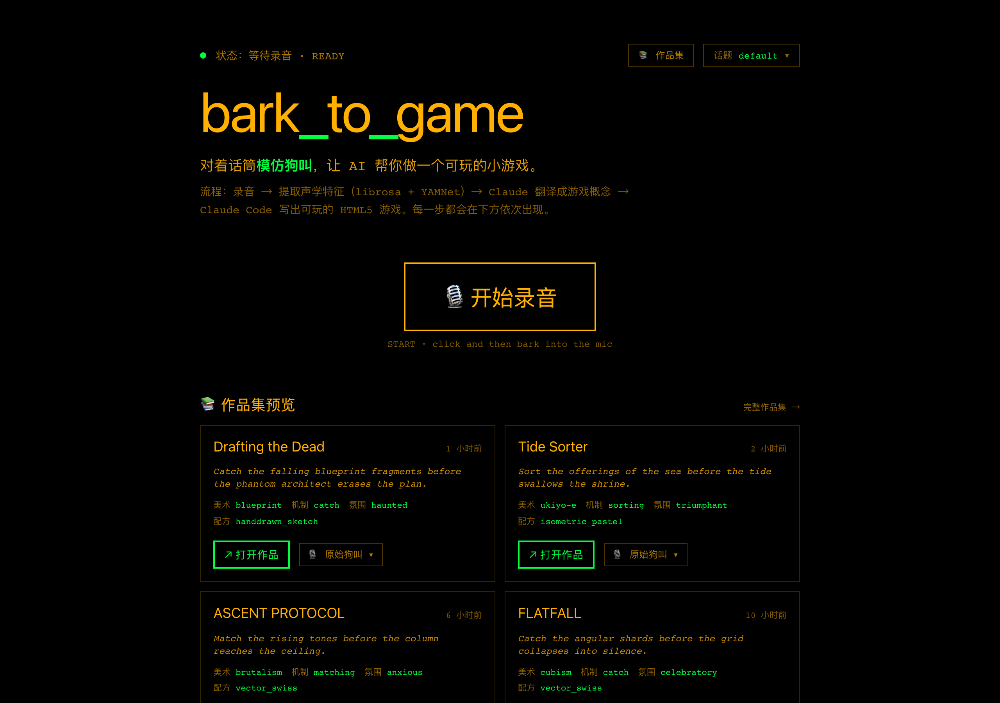
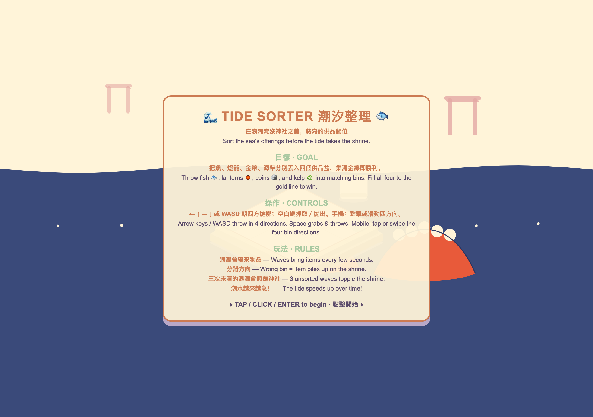
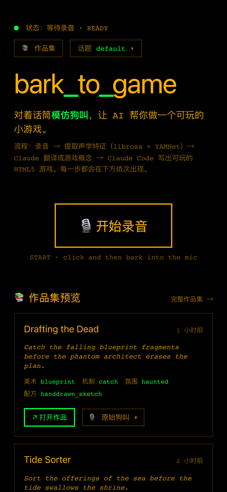
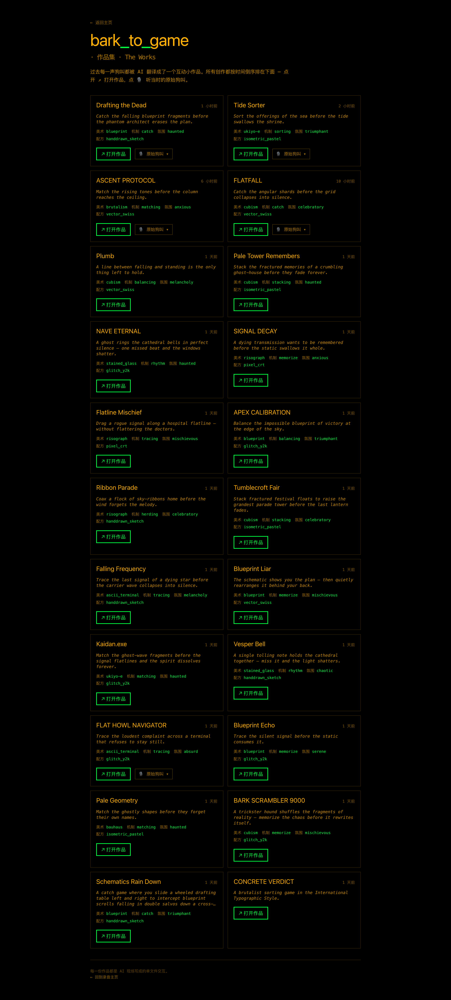

# bark-to-game

> Hold a button. Mimic a dog. Get a playable HTML5 game generated from your bark.

Inspired by [Caleb Leak — "I Taught My Dog to Vibe Code Games"](https://www.calebleak.com/posts/dog-game/), but inverted: instead of a dog typing on a keyboard, **a human pretends to be a dog and a carefully designed surrounding system turns the low-information audio into a unique, on-style, playable game**.

The premise from the article — _the magic is not in the input, it is in the system around it_ — is what we test here.

## Screenshots

<p align="center">
  
  <br><sub><b>Homepage</b> — hold the dial and bark; the showcase below fills with everything you've made.</sub>
</p>

<p align="center">
  
  <br><sub><b>Every game opens on a bilingual rule card</b> (中文 + English: goal / controls / rules), drawn in one of 8 visual recipes — then the first interactive element pulses, so a stranger can start playing in under 5 seconds.</sub>
</p>

<p align="center">
  
  <br><sub><b>Records and plays on mobile</b> — Pointer-events capture over HTTPS (cloudflared tunnel) so <code>getUserMedia</code> works on phones.</sub>
</p>

<details>
  <summary><b>The <code>/works</code> gallery — every game ever generated, each with its original bark for playback (click to expand)</b></summary>
  <br>
  <p align="center"></p>
</details>

## Pipeline

```
microphone (browser MediaRecorder)
   │  16-bit PCM WAV upload
   ▼
backend audio analysis
   │  librosa (F0 pyin, RMS, spectral centroid, onset contour)
   │  YAMNet (TF Hub) — Bark / Yip / Howl / Growling / Whimper / Bow-wow
   │  compound tokens [TYPE · pitch · duration · intensity · contour]
   │  audio SHA256 → seed
   ▼
translation layer (claude-agent-sdk)
   │  Verbalized Sampling (k=5 candidates with probabilities)
   │  random style triplet (16 art × 24 mechanic × 16 mood, seeded by audio hash)
   │  random visual recipe (8 markdown style contracts)
   │  MAP-Elites archive (per-session) penalises recently-occupied cells
   │  pick argmax(p · (1 − similarity_to_recent))
   ▼
generation layer (claude-agent-sdk, async job)
   │  cp game_assets/playbook.md (reusable HTML5/Canvas patterns) into prompt
   │  per-round CLAUDE.md = concept + visual recipe + playbook
   │  Claude Code writes self-contained ./game.html
   │  POST returns job_id immediately; frontend polls /api/game/job/{id}
   ▼
playback (iframe)
   │  GET /api/game/{game_id}/play — FileResponse
   ▼
playable game in the user's browser
```

## What ships

| Phase | Branch (merged) | Contents |
|---|---|---|
| 0 | `feat/phase-0-scaffold` | Repo bootstrap, three sub-projects (backend / frontend / game-template), CRT terminal aesthetic placeholder |
| 1 | `feat/phase-1-audio` | Audio recording UI (hold-to-bark, mobile-friendly Pointer events), `/api/audio/analyze` returning compound token segments + session summary (rhythm/mood/entropy) + audio_hash |
| 2 | `feat/phase-2-translate` | `claude-agent-sdk` translation, Verbalized Sampling, 16×24×16 style cards, 8 visual recipes, MAP-Elites archive in `data/archive/{session}.json`, ConceptCard UI |
| 3 | `feat/phase-3-generate` | Async job game generation (POST → 202 + job_id, async SDK call, polling endpoint), asset playbook in `game_assets/`, iframe player with live elapsed timer |
| 4 | `feat/phase-4-sessions` | Application-level sessions (`/api/sessions`), SessionSwitcher in header backed by `localStorage` + `useSyncExternalStore`; session id threaded through translate + generate; isolates the diversity archive |

Total: **148 backend tests**, **15 frontend tests**, all gates clean (typecheck / lint / format / build) across both Python and TypeScript.

## Stack

| Layer | Tech |
|---|---|
| Backend | Python 3.13, FastAPI, `uv`, librosa, TF Hub YAMNet (heuristic fallback), `claude-agent-sdk` ≥ 0.2.82 |
| Frontend | Vite 8, React 19, TypeScript 6 (strict), Tailwind v4, Vitest |
| Game template | Phaser 4 + Vite + TS (for future heavier games) |
| Tests | pytest, Vitest, Playwright (desktop + mobile e2e for Phases 1 + 2) |

## Run locally

Requires Node 22+, pnpm 9+, Python 3.13, [`uv`](https://docs.astral.sh/uv/), and an authenticated [Claude Code CLI](https://docs.claude.com/en/docs/claude-code) (the SDK runs through your existing subscription, no separate API key).

```bash
git clone https://github.com/Keith9922/bark-to-game.git
cd bark-to-game

# Backend (first run downloads ~2 GB of TF + librosa)
cd backend
uv sync
uv run fastapi run bark_to_game/main.py --port 8000 &

# Frontend
cd ../frontend
pnpm install
pnpm dev   # http://localhost:5173
```

Then in the browser:

1. Allow microphone access
2. Hold the "HOLD TO BARK" dial for ~1–3 seconds while mimicking a dog
3. Release — wait for `analyze` (≈1 s warm, ≈60 s on first cold call due to TF/librosa import)
4. `translate` runs Verbalized Sampling under a randomly-seeded style triplet; concept appears
5. `generate` queues an async job; the building section shows live elapsed time; iframe loads the playable game when done
6. Switch sessions from the header dropdown to get a fresh diversity archive

## Known caveats

- **YAMNet currently falls back to a heuristic classifier** on this stack — `tensorflow_hub` imports `pkg_resources` (deprecated, missing from Python 3.13). `setuptools` is in the dependencies; if the warning persists, run `uv pip install -U setuptools` in the venv. The pipeline functions either way; only the dog-class confidence drops from real YAMNet (≈0.7–0.95) to heuristic (0.3–0.5).
- **The Claude Code SDK shares your Max-plan quota with any active Claude Code conversation.** Phase 3 generation can be rate-limited to 7–8 minutes per agent turn if you're running it from inside another live Claude Code session. To verify generation end-to-end, run it standalone (close other Claude Code conversations first).
- Generated games persist in `generated-games/{game_id}/` and remain addressable via `/api/game/{game_id}/play` across restarts.

## Anti-homogenization mechanics

Three layers stack to prevent generations from converging on the same shapes (the original article calls this out as the main quality risk):

1. **Input** — compound tokens carry 5 orthogonal dimensions (type × pitch × duration × intensity × contour). The audio SHA256 seeds the style triplet selection so the same recording is reproducible but a slightly different recording diverges.
2. **Translation** — Verbalized Sampling forces the model to surface 5 candidates with probabilities, bypassing the RLHF mode collapse documented in [arXiv 2510.01171](https://arxiv.org/abs/2510.01171). Selection prefers concepts dissimilar to the recent archive entries.
3. **Generation** — per-round `CLAUDE.md` rewrite with a hard "follow the visual recipe literally" contract, randomly-selected from 8 hand-authored recipes (`pixel_crt`, `handdrawn_sketch`, `glitch_y2k`, `isometric_pastel`, `vector_swiss`, `neon_noir`, `papercut_layered`, `watercolor_ink`).

Switch sessions to get an empty archive and a different style seed-space.

## Docs

- [`docs/PLAN.md`](./docs/PLAN.md) — phase split + user journey
- [`docs/ARCHITECTURE.md`](./docs/ARCHITECTURE.md) — pipeline + module boundaries + anti-homogenization
- [`docs/REFERENCES.md`](./docs/REFERENCES.md) — papers + reusable repos we built on top of
- [`CLAUDE.md`](./CLAUDE.md) — operating manual (dev standards, skill loading rules) for any Claude working on this repo

## License

MIT — see [`LICENSE`](./LICENSE).
